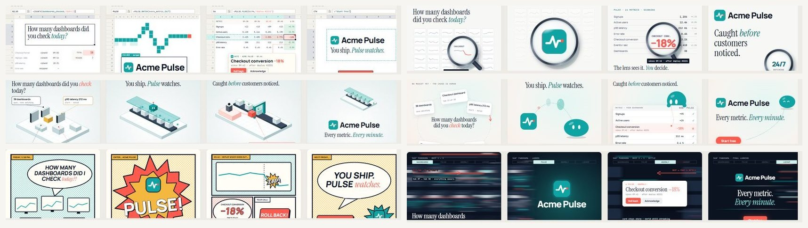

# saas-motion-kit

**Promo and motion videos for software products, made with [HyperFrames](https://github.com/heygen-com/hyperframes) and Claude Code.**

> **The one rule: no two films should feel like the same film.** Don't repeat effects, transitions or components. Invent a new component for every film. Decide the message and the tone before you pick a single effect.

This kit trains that creative muscle. It combines a staged process, a component strategy, **100 visual themes**, a **24-transition atlas** and a **variety audit** that catches repetition in your storyboard before you build it.

[Türkçe README →](README.tr.md) · [Theme gallery →](https://tugrawork-creator.github.io/saas-motion-kit/) · [Transition atlas →](https://tugrawork-creator.github.io/saas-motion-kit/transitions/) · [Creative muscle →](creative) · [Example →](examples/acme-suite-loop)

## What's new in v1.1: the creative muscle

- **[`creative/`](creative)** is the new heart of the kit: seven questions to ask at every storyboard, a [tone matrix](creative/tone-matrix.md) ("I want to say ___ in a ___ tone") that maps tone to speed, eases, camera, colour, type, transitions and sound, the [variety rules](creative/variety-rules.md), and a [component forge](creative/component-forge.md) for inventing a new component in 15 minutes.
- **[Transition atlas](https://tugrawork-creator.github.io/saas-motion-kit/transitions/):** 24 *narrative* transitions (match cuts, carries, camera moves, masks, materials, time), each with a live demo, the tone it fits and what not to pair it with.
- **`tools/variety_audit.py`** reads the storyboard ledger and flags repeated transitions, entrances, eases, directions, uniform shot lengths, missing surprises, accent overuse, tone mismatches and missing new components. With `--history` it remembers your previous films, so you don't repeat your last three.
- **The Acme example, rebuilt as a lesson.** We ran the audit on our own first draft. It caught **11 repetitions**: the same turntable turn five times, the same title entrance, one ease everywhere, equal shot lengths and no surprise. v2 gives every product its own entrance (letters out of blur, mask wipe, a word carried between shots, drop from above), varies the turns (whip with motion blur, slow sine), uneven shot lengths, and one surprise where Forecast floods teal while the camera dollies in. Before and after are in [`examples/acme-suite-loop`](examples/acme-suite-loop), and the new render is on the [v1.1 release](https://github.com/tugrawork-creator/saas-motion-kit/releases/tag/v1.1).
- The storyboard template now opens with a **Message & tone** sentence and a one-row-per-shot **ledger**, and the `/saas-motion-video` skill runs a **creative pass** gate before any build.



> Every example in this repo uses **Acme**, a fictional company, and its fictional products. All numbers are invented.

---

## What's inside

| Path | What it is |
|---|---|
| [`creative/`](creative) | **The creative muscle:** the seven questions, tone matrix, variety rules, component forge and transition atlas |
| [`playbook/`](playbook) | A 7-stage production playbook with a review gate at each stage |
| [`components/`](components) | The **clean-or-imaginary** component rule: use the product's real UI when it is clean, otherwise design imaginary UI |
| [`docs/`](docs) | GitHub Pages: the **100-theme gallery** (4 key frames, component kit, motion notes and references per theme) and the **live transition atlas** |
| [`examples/acme-suite-loop/`](examples/acme-suite-loop) | A complete HyperFrames project: a silent, seamless 40 s 3D booth loop, with its v1 → v2 variety-audit lesson |
| [`.claude/skills/saas-motion-video/`](.claude/skills/saas-motion-video) | A Claude Code skill that runs the whole process with you |
| [`templates/`](templates) | `BRIEF.md`, `STORYBOARD.md` and the theme-sheet template |
| [`tools/`](tools) | **Variety audit**, delivery (4K → 1080p/2K), loop-seam check, warm UI SFX synth, gallery builders |

## The process in one picture

```
1 Brief ──▶ 2 Components ──▶ 3 Theme ──▶ 4 Storyboard ──▶ 5 Build ──▶ 6 Sound ──▶ 7 Deliver
   ▲ gate      ▲ gate          ▲ gate      ▲ gate           ▲ gate      ▲ gate      ▲ gate
```

Each stage ends with a **human decision**. The agent does the production work; you bring taste at the gates. That split is what makes the result feel made by a person. See [`playbook/`](playbook).

At stage 4 the **creative pass** is mandatory: write the message-and-tone sentence, fill the ledger, run `python tools/variety_audit.py STORYBOARD.md`, then fix the repeats or mark them as deliberate `motif:`s.

## Clean components, or imaginary ones

Promo videos for software live or die on the UI you show. The rule:

1. **The product has clean UI** (consistent, uncluttered, current): capture it and animate the real components. Cards, tables, charts and toasts are rebuilt in HTML from your design tokens, not pasted in as screenshots.
2. **It doesn't** (legacy screens, dense admin panels, nothing designed yet): **design imaginary components**. These are simplified, idealised pieces of UI that tell the truth about what the product does, drawn in the brand's tokens.
3. **Never** fake capabilities, numbers or customers. An imaginary component may simplify the product but must not claim anything it doesn't do.

Details, a decision checklist and examples: [`components/`](components).

## 100 themes, one story

The same 45-second story about the fictional **Acme Pulse**, an AI that watches product metrics and flags anomalies, is drawn in 100 different visual languages across 10 families:

| Family | Themes |
|---|---|
| Product UI as the stage | 001–010 |
| Typography & graphic systems | 011–020 |
| Material & 3D | 021–030 |
| Light, optics & texture | 031–040 |
| Metaphor concepts | 041–050 |
| Signature directions | 051–062 |
| Data storytelling | 063–072 |
| Characters & mascots | 073–082 |
| Art movements & eras | 083–092 |
| Camera & edit grammar | 093–100 |

Each sheet shows **Hook → Reveal → Proof moment → CTA**. It also lists six components, three motion techniques with timings, the risk to watch for, how to adapt the theme to your own product, and references. Open the [gallery](https://tugrawork-creator.github.io/saas-motion-kit/), pick two or three themes, and put them in your brief.

## Quick start

**Requirements:** Node.js 22+, ffmpeg, Claude Code. HyperFrames downloads its own headless Chrome.

```bash
# 1. get the kit
git clone https://github.com/tugrawork-creator/saas-motion-kit && cd saas-motion-kit

# 2. install the HyperFrames skills for Claude Code (not vendored here)
npx skills add heygen-com/hyperframes

# 3. try the example
cd examples/acme-suite-loop
npx hyperframes preview          # live preview in the Studio
npx hyperframes render --quality delivery --resolution landscape-4k --output renders/loop-2160.mp4
```

Then open Claude Code in the repo root and start a video:

```
/saas-motion-video  Make a 45 s LinkedIn promo for https://your-product.com — theme 055 (Bento Grid), music-driven, no voiceover.
```

The skill walks you through the seven stages and stops at each gate.

## Rendered examples

Rendered MP4s are attached to the [Releases](../../releases) page, so the repository stays small.

## Lessons that save hours

- **Render at 4K, deliver smaller.** Render `landscape-4k` or `square-4k`, then downscale with Lanczos (`tools/deliver.sh`). Edges, text and 3D come out visibly cleaner than a native 1080p render.
- **Seek-safe or it breaks.** Every frame must be a pure function of time: one paused GSAP timeline, Three.js driven from `hf-seek`, no `Date.now()`, no unseeded random.
- **Loops:** give every ambient motion a whole number of cycles per loop (`sin(2π·n·t/LOOP)`), and verify the seam with `tools/loop_check.py`.
- **Fonts with non-Latin characters:** ship `latin-ext` subsets locally. Built-in fallbacks silently lose glyphs such as ş, ğ and İ.
- **Uppercase text:** in some languages (for example Turkish) CSS `text-transform: uppercase` changes "i" into "İ". Type display text in uppercase yourself and set `lang` per word.
- **Sound:** pure sine blips sound thin and eerie. Warm tuned timbres (marimba or wood block in one key, short room reverb) feel friendly (`tools/warm_sfx.py`).
- **Less text.** If a viewer needs to read to follow the story, the visuals aren't doing their job. Keep on-screen words to labels and one line per beat.
- **No progress bars.** A timeline bar at the bottom makes a brand film look like a screen recording.

## Credits and licenses

- Code and docs: [MIT](LICENSE).
- Fonts in `docs/assets/fonts` and `examples/*/assets/fonts` (Manrope, Instrument Serif, JetBrains Mono): SIL Open Font License 1.1, see [LICENSES](docs/assets/fonts/LICENSES.md).
- [HyperFrames](https://github.com/heygen-com/hyperframes) is by HeyGen. Install its skills with `npx skills add heygen-com/hyperframes`.
- If you generate music locally with Meta's MusicGen, note that its weights are **CC-BY-NC 4.0 (non-commercial)**. Use licensed music for commercial work.
- Acme, Acme Pulse and Acme Suite are fictional. Any resemblance to real products is coincidental.
