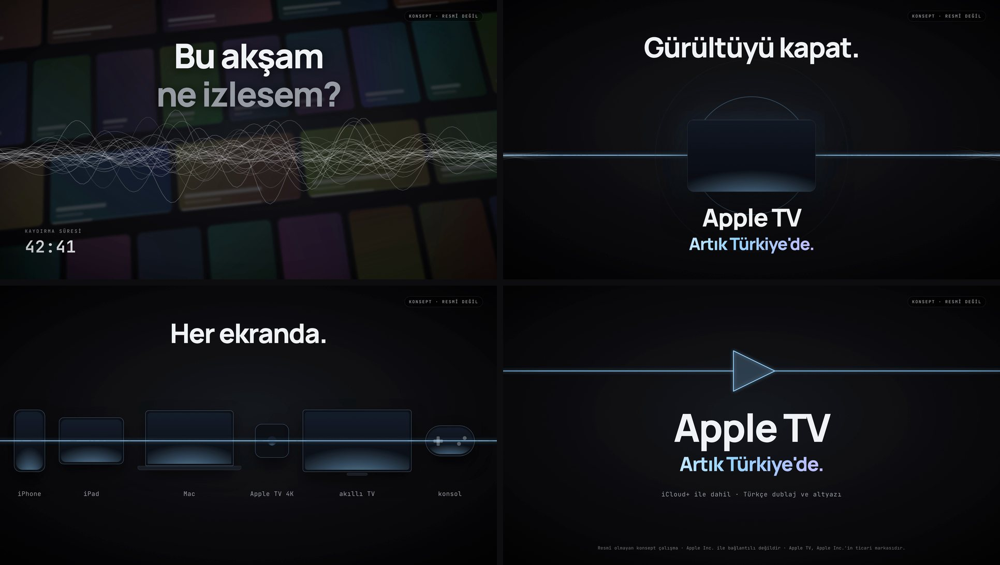

# Apple TV, now in Türkiye: an unofficial spec film

> **Spec work, not an Apple ad.** This is an unofficial concept film, made to show the kit's hardware-ad grammar on a real, current launch. It is not affiliated with, endorsed by or made for Apple Inc. Apple TV, iCloud+, iPhone, iPad, Mac and Apple TV 4K are trademarks of Apple Inc. The film uses no Apple logos, no Apple typefaces and no show artwork. A "KONSEPT · RESMÎ DEĞİL" tag sits on every frame, and the end card carries the full disclaimer. It is the only example in this repo that names a real product. Every other example uses the fictional Acme.

**Theme:** [101 Noise Cancelling](../../docs/themes/101-noise-cancelling.html), redesigned for the living room · 1920×1080, rendered at 4K · 24 s · 30 fps · synthesised score, no voice · on-screen copy in Turkish



Apple TV opened officially in Türkiye in September 2026, included in iCloud+, with Turkish dubbing and subtitles. The film tells that launch with the noise-cancelling headphone ad's grammar. Endless rows of things to watch and a field of hairline waves build into noise. The mix cuts to true silence. A quiet zone opens around a single screen, and every wave collapses into one ice-blue line. That line runs through the rest of the film, and at the end it bends into a play button.

The brief, with the verified facts and their sources, is in [BRIEF.md](BRIEF.md). The film states nothing else: no prices, no show titles, no numbers about the service.

## Tone
> I want to say "turn off the noise, and the story is what's left: Apple TV is now in Türkiye" in a premium, cinema-quiet tone, so the viewer feels the relief of the moment the scrolling stops.

## Beats
| time | beat | what happens |
|---|---|---|
| 0–5 s | hook | Four rows of untitled poster tiles stream sideways and speed up, while a scroll timer runs from 41:57. Then 34 white hairline waves swell over the dimmed rows, and "Bu akşam / ne izlesem?" sets word by word. |
| 5.0–5.8 s | silence | **Surprise:** the mix hard-cuts to digital silence and the frame freezes for 0.8 s. |
| 5.8–9.5 s | reveal | A dark screen slab glows on. The quiet zone opens from it, and every wave inside goes flat into one line. One soft note per line of type: "Gürültüyü kapat.", "Apple TV", "Artık Türkiye'de." |
| 9.5–12.5 s | proof | The same screen is carried left, grows and starts playing a dusk scene. The audio and subtitle switches slide to Türkçe, and a subtitle rises: "Sessizliği duyuyor musun?" |
| 12.5–15.1 s | proof | Match cut: the selected Türkçe pill becomes the "dahil" pill of an iCloud+ card. "iCloud+ aboneliğine dahil." |
| 15.1–18.5 s | proof | Whip pan. **Surprise:** the silent line threads six generic screens (iPhone, iPad, Mac, Apple TV 4K, smart TV, console), and a light sweep wakes them one by one, with a rising pluck for each. "Her ekranda." |
| 18.5–24 s | CTA | The line rises and bends into a play triangle. "Apple TV", "Artık Türkiye'de.", a recap line and the disclaimer. The last second is silent and still. |

## New component: play line
The film's motif ends as an interface. The flat line opens a gap at its centre, and two vertices lift out of it to form a play triangle. The stroke stays the line's stroke, so the viewer reads it as the same object that ran through the whole film. Motion signature: the gap opens over 0.5 s (`expo.inOut`), the vertices lift ±78 px over 0.7 s, and the fill fades to 14 % ice once the shape closes.

## Transitions
| cut | transition | why |
|---|---|---|
| tiles → noise | **parallax push** | The camera pushes through the rows of things to watch, into the noise they make. |
| noise → silence | **hard cut** | The film's thesis in one edit: everything stops. |
| silence → reveal | **quiet-zone iris** | The quiet opens from the screen, so the product is where the calm starts. |
| reveal → proof | **T05 Object Carry** | The same screen carries into the proof and starts playing, with Turkish subtitles. |
| subtitles → plan | **match cut** | "Türkçe" becomes "dahil" in the same pill: both say "this is already yours". |
| plan → devices | **whip pan** | The only fast move after the drop, from what you pay to where you watch. The line stays still while the world moves. |
| devices → CTA | **line morph** | The line that ran through every screen rises and becomes the play button. |

## Sound
`score.py` synthesises the whole mix with numpy: scroll ticks, hiss, out-of-key notification pings, a detuned drone and a riser that all climb to 5.0 s. Then comes a hard cut to digital silence with no reverb tail, the first soft marimba note at 5.8 s, a quiet C-major pad under the proof, and a resolving chord at 19.5 s. From 23.0 s to the end there is digital silence again. It is seeded, so every run writes the same file. There are no samples and no music licence.

## Variety audit
```
variety audit · examples/spec-apple-tv-tr/STORYBOARD.md · 8 shots
  [info] transitions: 7 cuts · families {'camera': 2, 'cut': 2, 'mask': 1, 'carry': 1, 'other': 1}
  => no repetition found. Now go check it with your eyes.
```

## Verify and render
```bash
python score.py                            # writes assets/audio/score.wav (renders need it; .wav files are gitignored)
npx hyperframes lint                       # 0 errors (12 structure warnings: single-file composition)
npx hyperframes check --timeout 120000     # passed: runtime 0, layout 0 issues, contrast 20/20 AA
npx hyperframes render --quality delivery --resolution landscape-4k --output renders/film-2160.mp4
../../tools/deliver.sh renders/film-2160.mp4 1920x1080 renders/film-1080p.mp4   # Lanczos + -14 LUFS target
```

The rendered film is attached to the v1.3 release, so the repository stays small.

Assets: Manrope and JetBrains Mono, including their `latin-ext` subsets for ş, ğ and İ (SIL OFL 1.1, `assets/fonts/OFL.txt`). GSAP is the only external script. The poster tiles are untitled colour fields generated from a fixed seed, and the devices are generic rounded rectangles.
