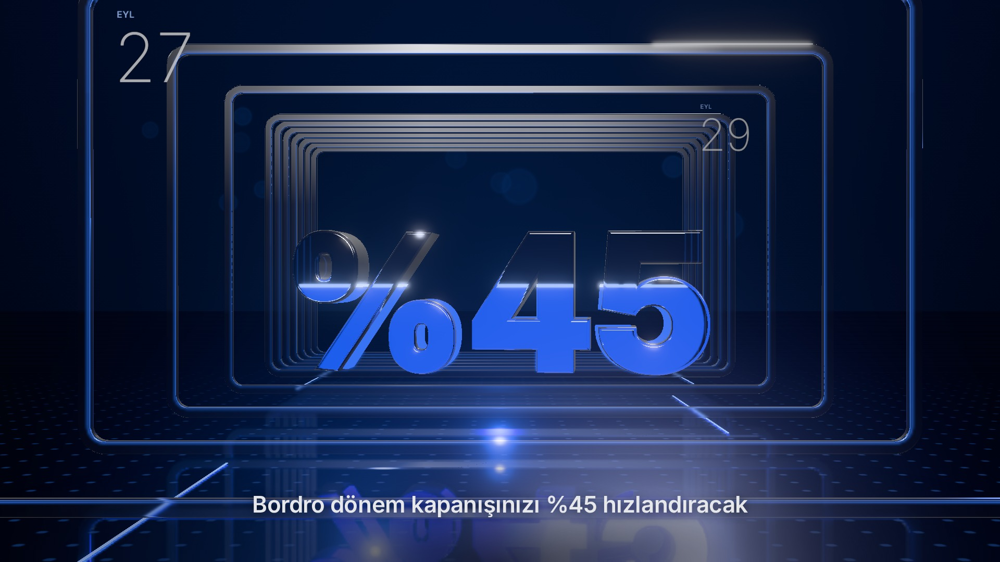
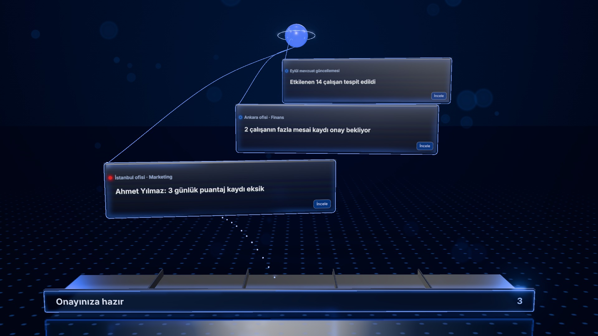
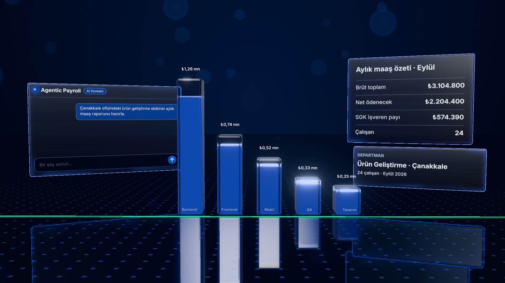
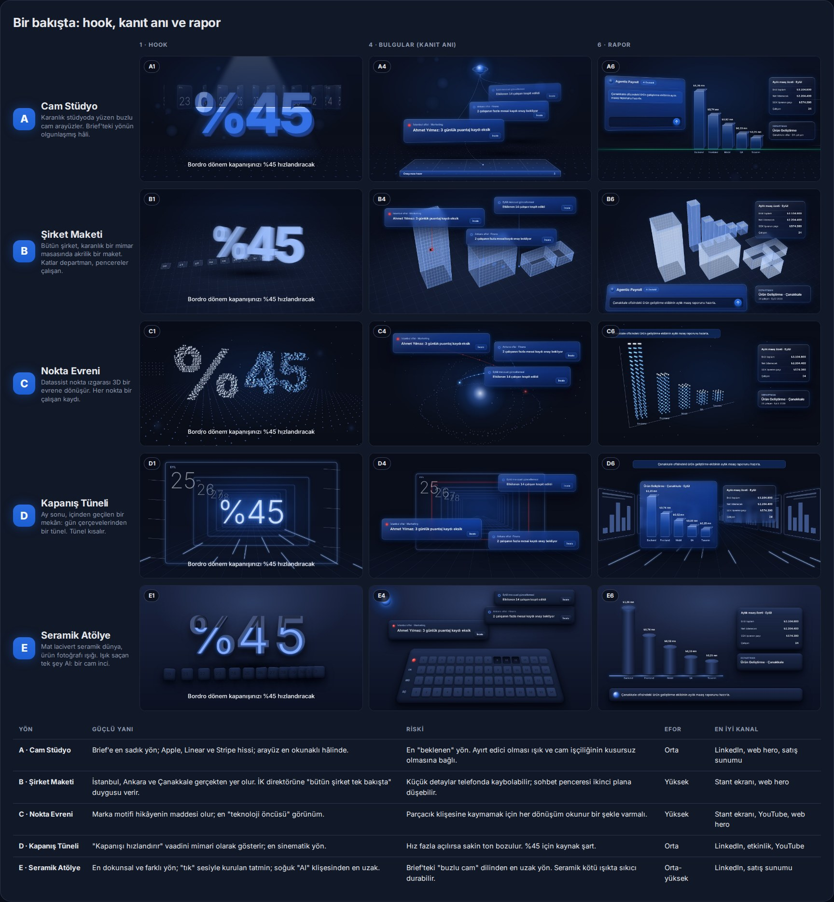

# Agentic Payroll: "Sağ kol" tanıtım filmi

58 sn, 16:9 master (3840×2160) ve ondan türeyen 4:5, 1:1 ve 9:16 kesimler. Brief: [`BRIEF.md`](BRIEF.md).

**Durum:** yön seçildi (**A + D hook**: Cam Stüdyo dünyası, Kapanış Tüneli hook'u) → [`STORYBOARD.md`](STORYBOARD.md). Üç styleframe hazır ve onay bekliyor → [`styleframes/`](styleframes).

| SF1 · Hook | SF2 · Kanıt anı | SF3 · Rapor |
|---|---|---|
|  |  |  |

Aşağıda seçim öncesinde hazırlanan beş alternatif yön duruyor.



## Beş yön

Senaryo, ekrandaki metinler, marka renkleri ve kurallar beş yönde de aynı. Değişen şeyler dünya, malzeme, kamera dili ve her yönün kendine ait yeni bileşeni. Beşi de `tools/variety_audit.py` denetiminden "no repetition found" ile geçti. Herhangi iki yön arasında ortak tek bir geçiş, giriş ya da yeni bileşen yok.

| | Yön | Dünya | Yeni bileşen | Geçiş aileleri | Pano |
|---|---|---|---|---|---|
| A | [Cam Stüdyo](storyboards/A-cam-studyo/STORYBOARD.md) | karanlık stüdyoda yüzen buzlu cam arayüzler (brief'teki yön) | onay tepsisi | 6 | [A.jpg](storyboards/sketch/boards/A.jpg) |
| B | [Şirket Maketi](storyboards/B-sirket-maketi/STORYBOARD.md) | mimar masasında akrilik şirket maketi; pencereler çalışan | pencere puantajı | 4 | [B.jpg](storyboards/sketch/boards/B.jpg) |
| C | [Nokta Evreni](storyboards/C-nokta-evreni/STORYBOARD.md) | marka nokta ızgarası 3D bir evren; her nokta bir çalışan kaydı | nokta sayımı | 6 | [C.jpg](storyboards/sketch/boards/C.jpg) |
| D | [Kapanış Tüneli](storyboards/D-kapanis-tuneli/STORYBOARD.md) | gün çerçevelerinden bir tünel; kapanış kısalır | teleskop takvim | 6 | [D.jpg](storyboards/sketch/boards/D.jpg) |
| E | [Seramik Atölye](storyboards/E-seramik-atolye/STORYBOARD.md) | mat lacivert seramik; ışık saçan tek şey AI incisi | puantaj taşları | 5 | [E.jpg](storyboards/sketch/boards/E.jpg) |

Karşılaştırma tablosu (güçlü yan, risk, efor, kanal) ve bütün kareler: `storyboards/sketch/index.html`.

## Klasör

```
BRIEF.md                         aşama 1: brief ve açık maddeler
STORYBOARD.md                    seçilen yön (A + D hook): defter, yedi soru, kareler
styleframes/                     SF1–SF3, gerçek 3D (three.js) · 4K + önizleme
assets/brand/                    orijinal logo PNG'leri buraya (henüz yok)
storyboards/<yön>/STORYBOARD.md  mesaj ve ton, defter (ledger), yedi soru, kareler
storyboards/sketch/
  frames.html · frames.js · frames.css   35 eskiz karesinin kaynağı (1600×900, deterministik)
  frames/*.jpg                           render edilmiş kareler
  index.html                             storyboard sayfası (panolar + karşılaştırma)
  boards/*.jpg                           sayfanın bölümleri, görüntü olarak
  render.cjs · build_single.py           yeniden üretim
```

## Yeniden üretmek

```bash
# tekrar denetimi (beşi de temiz olmalı)
for f in films/agentic-payroll/storyboards/*/STORYBOARD.md; do python tools/variety_audit.py "$f"; done

# kareler ve panolar (Playwright'ın Chromium'u ile)
cd films/agentic-payroll/storyboards/sketch
NODE_PATH=$(npm root -g) node render.cjs frames all
NODE_PATH=$(npm root -g) node render.cjs boards
python build_single.py /tmp/agentic-payroll-storyboards.html   # paylaşım için tek dosya
```

## Sonraki adımlar

1. ~~Yön seçimi~~ → A + D hook.
2. ~~Styleframe'ler~~ → SF1–SF3 hazır, **onay bekliyor**.
3. **Açık maddeler** (`BRIEF.md`): "%45" için kaynak, logo dosyaları, müzik lisansı, seslendirme kararı.
4. **Animatik**: storyboard zamanlamasıyla, geçici sesli, düşük çözünürlüklü tam akış.
5. **Build**: HyperFrames kompozisyonu (styleframe sahneleri + GSAP zaman çizelgesi), `lint`, `snapshot`, `check`.
