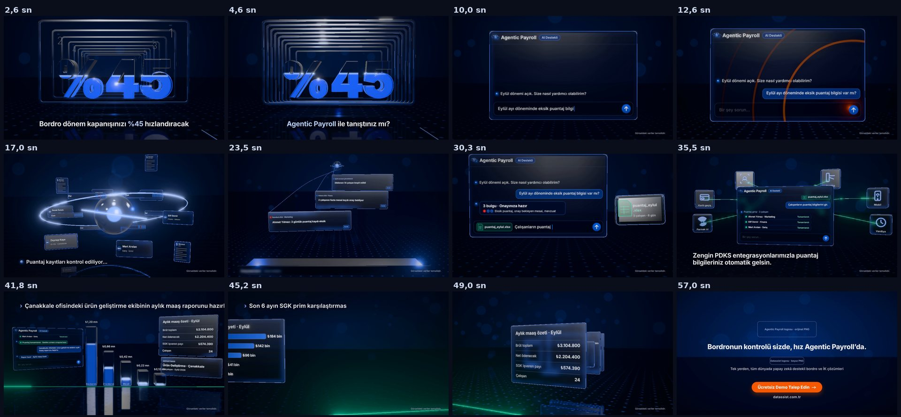

# Agentic Payroll: "Sağ kol" tanıtım filmi

58 sn, 16:9. Kompozisyon 1920×1080, master 3840×2160 (`--resolution landscape-4k`). Brief: [`BRIEF.md`](BRIEF.md) · plan: [`STORYBOARD.md`](STORYBOARD.md).

**Durum:** film [HyperFrames](https://github.com/tugrawork-creator/hyperframes) ile kuruldu: repodaki `/hyperframes` → `/general-video` akışı, `hyperframes init` iskeleti, repo sözleşmesine göre alt kompozisyonlar. Seçilen yön **A + D hook**. Ses henüz yok; kitin 6. aşaması.

| Kontrol | Sonuç |
|---|---|
| `hyperframes lint` | 7 dosya · 0 hata · 0 uyarı |
| `hyperframes check` | geçti · runtime 0 hata · layout 0 hata · WCAG kontrast 75/75 |
| Kalan uyarılar | yalnızca yazılımsal WebGL'in "GPU stall due to ReadPixels" performans notu (GPU'lu makinede çıkmaz) |
| Taslak render | 58,0 sn · 1920×1080 · 30 fps · 1740 kare · H.264 · 3D katman yarım çözünürlükte · GPU'suz bulut ortamında 15 dk |

Render dosyaları repoya girmez (`renders/`, kitin kuralı: videolar GitHub Releases'e). Aşağıdaki kareler taslak render'dan, sahne ortalarından alındı (`tools/contact.py`).



## Nasıl kuruldu

| Katman | Dosya | Ne yapar |
|---|---|---|
| 3D dünya | [`assets/js/world.js`](assets/js/world.js) | Tek plan: tünel ve cam "%45", sohbet penceresi, AI çekirdeği ve yörüngeler, bulgular ve onay tepsisi, .xlsx kalıbı, PDKS halkası, raporlar, galeri, kapanış. three.js 0.186.1. Her kare `hf-seek` ile gelen zamanın saf fonksiyonu: saat yok, rastgelelik tohumlu, her kare her sırayla çizilebilir. |
| Cam üstü arayüz | [`assets/js/ui.js`](assets/js/ui.js) | Panellere basılan 2D arayüz (sohbet, bulgu kartı, tablo, grafikler, PDKS ikonları). Durum değişince yeniden çizilir. |
| 3D yardımcıları | [`assets/js/kit.js`](assets/js/kit.js) | Buzlu cam, mavi kenar ışığı, panel, çekirdek, yansıtan zemin, ease ve anahtar kare yardımcıları (GSAP ease'leri). |
| Yazı katmanları | [`compositions/frames/`](compositions/frames) | Her kare için HTML alt kompozisyon ve kendi GSAP zaman çizelgesi: hook başlıkları, durum etiketleri, PDKS satırı ve yeşil hap, promptlar, kapanış ve CTA, "temsilidir" notu. |
| Ortak takvim | [`assets/js/schedule.js`](assets/js/schedule.js) | Yazılan her prompt'un anları. 3D pencere ve HTML katmanı aynı takvimi okur. |
| Kök | [`index.html`](index.html) | 3D dünya katmanı ve alt kompozisyon yuvaları; kök zaman çizelgesi. |

Her şey yerel: GSAP 3.14.2, three.js ve Inter (latin + latin-ext, SIL OFL) projenin içinde. Render sırasında ağ isteği yok. Bu çalışma ortamında jsdelivr kapalı olduğu için kütüphaneler CDN yerine `assets/vendor/` altında.

## Komutlar

```bash
cd films/agentic-payroll
npx hyperframes@0.8.78 lint
npx hyperframes@0.8.78 check --timeout 30000     # 3D dünyanın kurulumu birkaç saniye sürüyor
npx hyperframes@0.8.78 preview                    # Studio → http://localhost:3002/#project/agentic-payroll
npx hyperframes@0.8.78 snapshot --at 2.4,23.5,44.6
# hızlı taslak: 3D katman yarım çözünürlükte, yazılar tam çözünürlükte
npx hyperframes@0.8.78 render --quality draft --variables '{"glScale":0.5}' --output renders/taslak.mp4
# master: 4K, 60 fps (teslimde 30 fps'e iner, tools/deliver.sh)
npx hyperframes@0.8.78 render --quality delivery --resolution landscape-4k --fps 60 --output renders/agentic-payroll-4k.mp4
```

`glScale` değişkeni (kompozisyonda tanımlı) yalnızca 3D katmanın iç çözünürlüğünü değiştirir. GPU'lu bir makinede render dakikalar sürer; GPU'suz ortamda WebGL yazılımla (SwiftShader) çalıştığı için çok daha yavaştır.

Geliştirirken 3D dünyayı tek başına hızlıca çizmek için: `NODE_PATH=$(npm root -g) node tools/frames.cjs --scale 0.5 2.4 23.5 44.6` (kareler `snapshots/dev/`) ve `python tools/sheet.py snapshots/dev sheet.jpg`.

## Repo notları

- **HyperFrames sürümü:** CLI `0.8.78`, forktaki `packages/cli` sürümü. Skill'ler forkun `skills/` klasöründen kuruldu. npm'de daha yeni bir sürüm var (0.8.82). Yükseltmek istenirse: `npx hyperframes@latest upgrade --project .` ve ardından `check`.
- **Çalışma biçimi:** `flow: automation`, `storyboard: no` → `mode: autonomous` (plan kitin 4. aşamasında onaylandı). Repo sözleşmesi gereği son (4K) render onaydan sonra alınır.
- **Tek plan:** 13 çekim tek bir 3D dünyada. Geçişler kamera, nesne ve ışıkla yapılıyor: portal, cama dalış, nesne taşıma, iris, çizgiden ufka, teleskop.

## Açık maddeler

1. **"%45" iddiasının kaynağı** (BRIEF.md, Açık maddeler 1). Kaynak yoksa hook rakamsız kurulur.
2. **Logo PNG'leri** → `assets/brand/`. Yuvalar hazır (`compositions/frames/07-close.html`, kesikli çerçeveler). Dosyalar gelince `` ile değiştirilecek; logolar asla yeniden çizilmez.
3. **Ses** (kitin 6. aşaması): lisanslı müzik, UI sesleri (`tools/warm_sfx.py`), seslendirme kararı.
4. **Dikey ve kare kesimler** (4:5, 1:1, 9:16): aynı dünyadan ayrı kompozisyon ayarlarıyla.

## Önceki aşamalar

- Beş alternatif yön ve eskiz panoları: [`storyboards/`](storyboards) (`storyboards/sketch/index.html`).
- Styleframe'ler (SF1–SF3, gerçek 3D): [`styleframes/`](styleframes).
